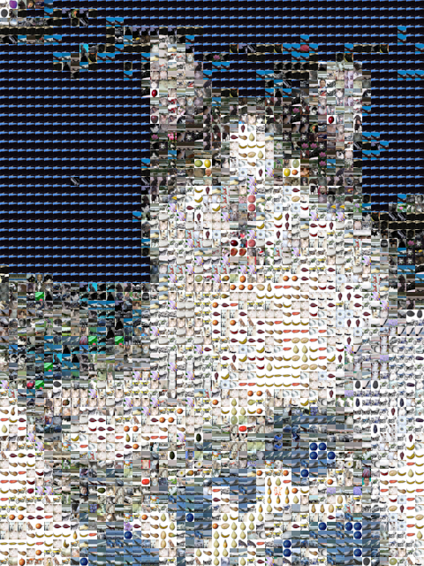

# CS3520 - PA03 - Photomosaics

_by Harrison Eckert_

This program takes a base image, and using a provided directory of images as a tileset, creates a Photomosaic of the base image.
The image can then be written to a provided output file, as a JPG file[*](#notes-to-tas).

# How to Run the Program

This program runs in 3 modes, depending on the number of supplied arguments.

## 3-arg Mode - Provide paths

When the program is provided with 3 arguments, they are interpreted as follows:
- `argv[1]` - the path to the base image for the mosaic
  - this file must be a valid JPG/JPEG, PNG, or BMP file
- `argv[2]` - the path to the directory containing all images in the desired tileset
  - all files in this directory will be explored recursively (i.e. images will be read from subdirectories)
- `argv[3]` - the path where the output mosaic will be written
  - the file extension __should NOT be provided__.

This run configuration will run the entire mosaic creation process, start to finish, and return. By default, it uses a 
tile size of 10x10. [This can be changed by modifying the construction of `m` in line 12 of `main.cpp`](main.cpp).

## 1-arg Mode - Testing

When the program is run with 1 argument, and that argument is `-t`, it is run in testing mode.

This mode is used to quickly test different parameters, including different base images, different tilesets, and 
different tile sizes. [If desired, the test mode parameters can be modified, starting at line 20 in main](main.cpp).

If 1 argument is supplied and it is not `-t`, the run configuration is not considered valid, and the program will not run.

## 0-arg Mode - Interactive

When the program is run with no arguments, it is run in interactive mode.

In interactive mode, the user is prompted to enter parameters for their Photomosaic. These parameters are:
- path to the base image
- path to the tileset directory
- size of each tile in pixels
- path to write the output mosaic to (without file extension)

The program will then process the Photomosaic, write it to the desired output path, and return.

# Notes to TAs

Although the program by default writes the output mosaic as a JPG file, this can be changed by modifying the parameter
of [calls to `Photomosaic::writeOut()` in main](main.cpp) ([writeOut() defined here](lib/include/Photomosaic.h)). The 
parameter is of type `format_t`, which is defined [here in `Image.h`](lib/include/Image.h)
